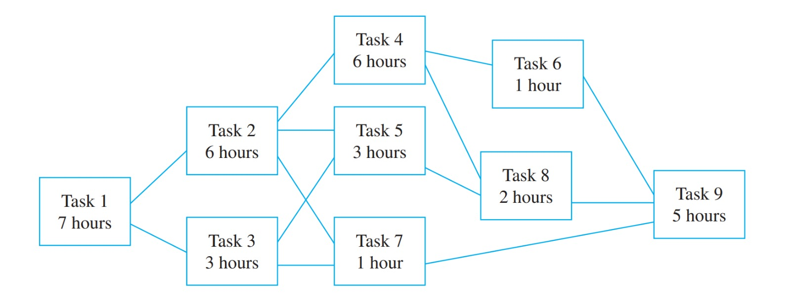
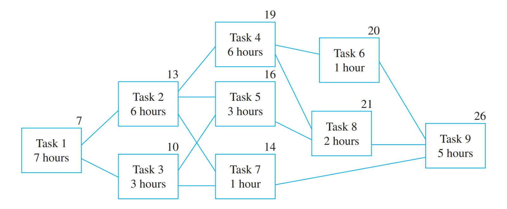

#  Minimum time required to assemble an automobile:
The assembling of a car at an automobile assembly plant plant can be divided into various steps:
1. Construct the frame.
2. Install engine, power train components, gas tank.
3. Install brakes, wheels, tires.
4. Install dashboard, floor, seats.
5. Install electrical lines.
6. Install gas lines.
7. Install brake lines.
8. Attach body panels to frame.
9. Paint body

Some of these processes can be done at the same time, while others must wait until the preceding tasks are complete. Following table gives an overview of the order of the tasks and how long it takes to carry each one out:
| Task | Immediately Preceding Tasks | Time Needed to Perform Task |
| :-------: | :-------: | :----------------: |
|   1       |           |     7 hours        |
|   2       |   1       |     6 hours        |
|   3       |   1       |     3 hours        |
|   4       |   2       |     6 hours        |
|   5       |   2, 3    |     3 hours        |
|   6       |   4       |     1 hours        |
|   7       |   2, 3    |     1 hours        |
|   8       |   4, 5    |     2 hours        |
|   9       |   6,7,8   |     5 hours        |

Let $\mathbb{T}$ be the set of all tasks, and consider the partial order relation defined on $\mathbb{T}$ as follows: For all tasks $x$ and $y$ in $\mathbb{T}$,
$$x \preceq y \iff x = y \quad \vee \quad  x \enspace \text{precedes} \enspace y.$$

If the Hasse diagram of this relation is turned sideways, it has the appearance shown below:

#### What is the minimum time required to assemble a car? 
By working through the diagram from left to right, we can determine the minimum time required to assemble a car for each task. Starting with task $1$, which requires $7$ hours, we note this above the corresponding box. Moving to task $2$, we consider the completion time of task $1$ ($7$ hours) plus the $6$ hours needed for task $2$ itself, resulting in a minimum time of $13$ hours for task 2. Thus, we place the number $13$ above the box representing task $2$. Continuing this process, we find that task $3$ requires $10$ hours ($7$ hours for task $1$ plus $3$ hours for task $3$), so we place $10$ above the box for task $3$.

Now, let's determine the time required for task $5$. Tasks $2$ and $3$ must be completed before task $5$ can start. The minimum completion times for tasks $2$ and $3$ are $13$ and $10$ hours, respectively. To find the minimum time for task $5$, we add the time needed for task $5$ itself ($3$ hours) to the _maximum_ of the completion times for tasks $2$ and $3$, which is $13$ hours. This results in a minimum time of $ 3 + 13 = 16$ hours for task $5$. Thus, we place the number $16$ above the box for task $5$.

Using the same reasoning, we find that the minimum times for task $4$, $6$, $7$, $8$, and $9$ are $19$, $20$, $14$, $21$, and $26$ hours, respectively. These values are placed above the corresponding boxes, as shown in the diagram below:

This analysis shows that at least $26$ hours are required to complete task $9$ starting from the
beginning of the assembly process. When task $9$ is finished, the assembly is complete, so
$26$ **hours is the minimum time needed to accomplish the whole process.** This means that no matter how we schedule the tasks, we cannot finish the assembly in less than $26$ hours. However, this does not mean that we have to use exactly $26$ hours. We can use more time if we want to, as long as we respect the order of the tasks and their durations. For example, we can delay task $7$ until task $8$ is done, and still finish the assembly in $26$ hours. This would give us some flexibility in case of unexpected delays or problems. However, we cannot start task $7$ before task $2$ and task $3$ are done, or start task $9$ before task $6$, task $7$ and task $8$ are done. These are the constraints imposed by the partial order relation.

Also note that the minimum time required to complete tasks $1$, $2$, $4$, $8$, and $9$ in sequence is
exactly $26$ hours. This means that a delay in performing any one of these tasks causes a
delay in the total time required for assembly of the car. For this reason, the path through
tasks $1$, $2$, $4$, $8$, and $9$ is called a critical path.

***
#### References

[1] _Susanna S. Epp, Discrete Mathematics with Applications, Cengage, 2020_.

[2] _MIT OpenCourseWare, Mathematics for Computer Science_, [_6.042_.](https://ocw.mit.edu/courses/electrical-engineering-and-computer-science/6-042j-mathematics-for-computer-science-fall-2010/ "Go to MIT OCW 6.042")

